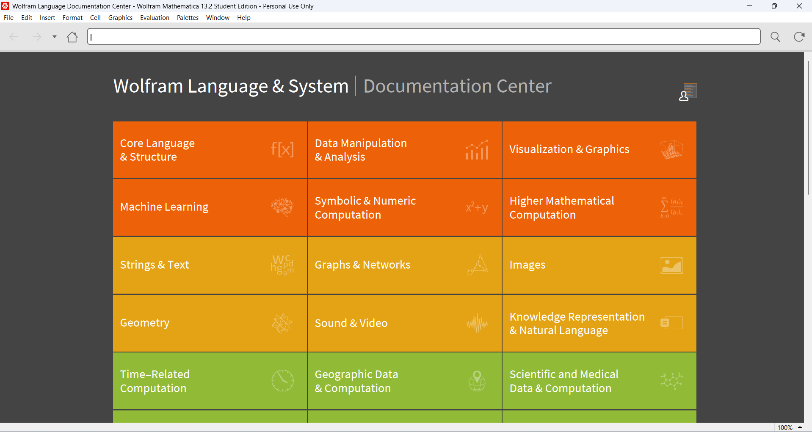
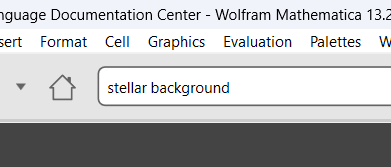
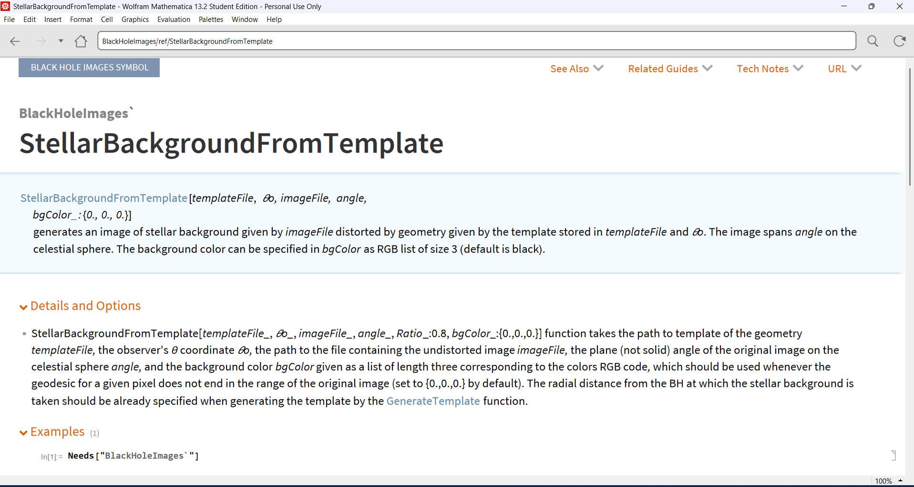

# Black Hole Images

`BlackHoleImages` is a Wolfram Mathematica paclet for generating null geodesics, images of accretion disks or images of stellar background in the Kerr geometry. It contains ready-to-use functions in the `KerrImages` package, which allow for the imaging of equatorial disks described by the simple "alpha disk" model proposed by Shakura and Sunyaev (1973), and also the stellar background distorted by the Kerr geometry. The functions for disk modeling are contained within the `AlphaDiskModel` package and the analytical implementation of null geodesics in the Kerr spacetime is contained within the `KerrNullGeodesics` package. The solutions for the null geodesics were mostly taken from Gralla and Lupsasca (2020) with some minor changes made to suit the initial conditions at infinity.

<p align="center">
  
</p>

## Installation

To use the code, make sure you have Wolfram Mathematica 13.2 or higher installed on your computer and a valid license.

After downloading the BlackHoleImages directory to a path, whose string we shall denote `path`, open a Mathematica notebook. We will need to use functions of `PacletTools`, so be sure to load them first:

```
Needs["PacletTools`"]
```

After that is done, you can build and install the paclet using the following funtions:

```
PacletBuild[path<>"/BlackHoleImages"]
PacletInstall[path<>"/BlackHoleImages/build/BlackHoleImages-1.0.0.paclet"]
```

The `1.0.0` denotes the version of the paclet. If you have a different version on your computer, be sure to change this.

After the paclet is built and installed, you can easily load it in Mathematica by using:

```
Needs["BlackHoleImages`"]
```

You should now be able to use functions of the paclet without further specifying the context. Note that the documentation to this paclet should install automatically together with the functions.

For detailed installation instructions, please refer to the official [paclet reference page](https://reference.wolfram.com/language/tutorial/Paclets.html#1080196144).

## Documentation

The documentation is provided as Mathematica pages, which is loaded together with the rest of the paclet. In the [Documentation](Documentation/English) folder, one may find guide pages and tutorials that should facilitate working with the paclet. To access function-specific documentation, press `F1`, just as you would for built-in Mathematica functions. You can also search for functions you need in the Documentation Center in Mathematica. We provide example screenshots demonstrating this:

<p align="center">
  
  
  
  
</p>

## License

The code is licensed under the MIT license. Please refer to [LICENSE](LICENSE) for more details.
