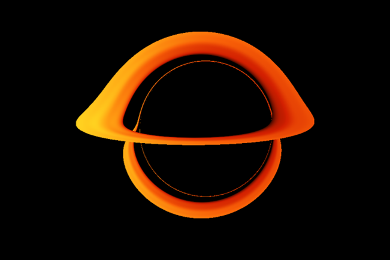
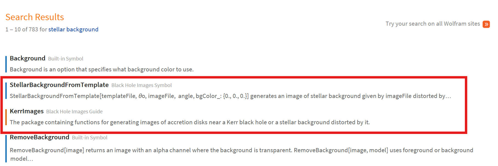
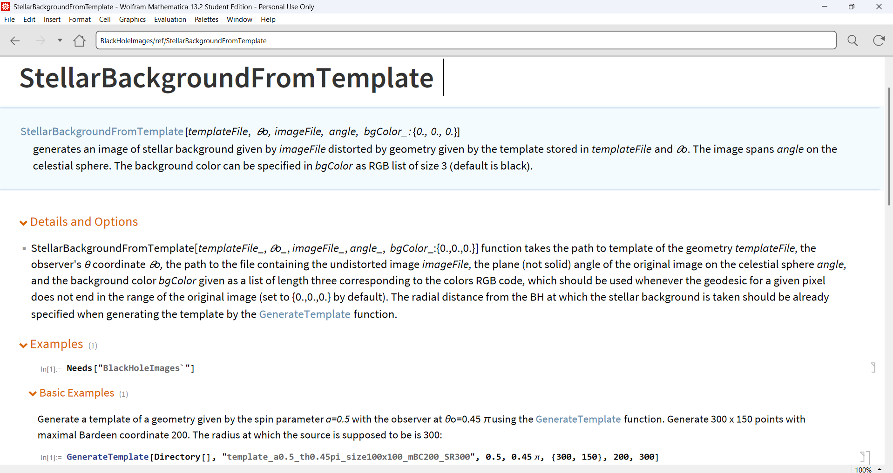
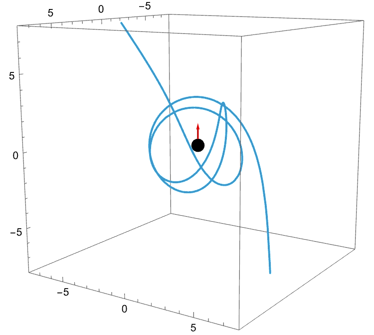

# Black Hole Images

`BlackHoleImages` is a Wolfram Mathematica paclet for generating null geodesics, images of accretion disks or images of stellar background in the Kerr geometry. It contains ready-to-use functions in the `KerrImages` package, which allow for the imaging of equatorial disks described by the simple "alpha disk" model proposed by Shakura and Sunyaev (1973), and also the stellar background distorted by the Kerr geometry. The functions for disk modeling are contained within the `AlphaDiskModel` package and the analytical implementation of null geodesics in the Kerr spacetime is contained within the `KerrNullGeodesics` package. The solutions for the null geodesics were mostly taken from Gralla and Lupsasca (2020) with some minor changes made to suit the initial conditions at infinity.

<p align="center">
  
</p>
## Overview

Black holes are astrophysical objects with gravitational fields so extreme that they bend even the trajectories of light. In the geometrical optics limit, light paths follow null geodesics in curved spacetime. This paclet provides analytical solutions for these geodesics and builds on them to generate realistic visualizations of black hole environments.

The paclet can be used for:

- :telescope: **Scientific research** on accretion disk properties and dynamics
- :book: **Educational use** for teaching relativity and black hole physics
- :sparkles:  **Visualization** of relativistic effects for presentations and outreach
- :bar_chart: **Reference implementation** for validating numerical simulations
- :dizzy: Computing photon orbits (null geodesics) in the gravitational fields of black holes
- :crystal_ball: Generating images of stellar backgrounds distorted by black hole gravity
- :dvd: Visualizing accretion disks near black holes using the standard α-disk model


## Installation

To use the code, make sure you have Wolfram Mathematica 13.2 or higher installed on your computer and a valid license.

After downloading the BlackHoleImages directory to a path, whose string we shall denote `path`, open a Mathematica notebook. We will need to use functions of `PacletTools`, so be sure to load them first:

```
Needs["PacletTools`"]
```

After that is done, you can build and install the paclet using the following funtions:

```
PacletBuild[path<>"/BlackHoleImages"]
PacletInstall[path<>"/BlackHoleImages/build/BlackHoleImages-1.0.0.paclet"]
```

The `1.0.0` denotes the version of the paclet. If you have a different version on your computer, be sure to change this.

After the paclet is built and installed, you can easily load it in Mathematica by using:

```
Needs["BlackHoleImages`"]
```

You should now be able to use functions of the paclet without further specifying the context. Note that the documentation to this paclet should install automatically together with the functions.

If you want to only want to use the code in a single session, using

```
PacletDirectoryLoad[path<>"/BlackHoleImages"]
Needs["BlackHoleImages`"]
```

suffices. Note however, that the documentation will not be installed with this method and cannot be used in the same way as for native Mathematica functions.

For detailed installation instructions, please refer to the official [paclet reference page](https://reference.wolfram.com/language/tutorial/Paclets.html#1080196144).

## Documentation

The documentation is provided as Mathematica pages, which is loaded together with the rest of the paclet if the paclet is built. In the [Documentation](Documentation/English) folder, one may find guide pages and tutorials that should facilitate working with the paclet. To access function-specific documentation, press `F1`, just as you would for built-in Mathematica functions. You can also search for functions you need in the Documentation Center in Mathematica. We provide example screenshots demonstrating this:

<p align="center">
  
  
  
  
</p>

We also provide [pdf prints](Documentation/English/PDF) of the notebooks which can be viewed independently of the Mathematica environment.

## Usage Examples

### Basic Example: Computing Null Geodesics

```mathematica
(*Load the package:*)
Needs["BlackHoleImages`"]

(*Compute a null geodesic for a black hole with spin a=0.9,\
viewed from angle \[Theta]o=\[Pi]/4, \
with Bardeen coordinates \[Alpha]=4.3774364,\[Beta]=4 
(The parameters are chosen to generate an interesting trajectory.): 
 *)
{\[CapitalDelta]v, r, \[Theta], \[Phi]} = 
 KerrNullGeoDistant[0.9, \[Pi]/4, 4.3774364, 4]["Trajectory"];

(*A sphere of the radius of the black hole horizon:*)
Horizon = Graphics3D[{Black, Sphere[{0, 0, 0}, Sqrt[1 - 0.9^2]]}] ;

(*The spin axis of the black hole:*)
SpinAxis = 
  Graphics3D[{Red, Arrowheads[0.015], 
    Arrow[Tube[{{0, 0, 0}, {0, 0, 1.5}}]]}] ;

(*Plot the geodesic trajectory:*)
TrajectoryPlot = 
 ParametricPlot3D[{r[\[Lambda]] Sin[\[Theta][\[Lambda]]] Cos[\[Phi][\
\[Lambda]]], 
   r[\[Lambda]] Sin[\[Theta][\[Lambda]]] Sin[\[Phi][\[Lambda]]], 
   r[\[Lambda]] Cos[\[Theta][\[Lambda]]]}, {\[Lambda], 0, 7}, 
  PlotRange -> {{-8, 8}, {-8, 8}, {-8, 8} }];

(*Show all the graphics together:*)
Show[TrajectoryPlot, Horizon, SpinAxis]
```



### Generating an Accretion Disk Image

```mathematica
(*Load package*)
Needs["BlackHoleImages`"]

(*Parameters:*)
a=0.9;         (*Black hole spin*)
\[Theta]o=\[Pi]/3;        (*Observer's angle*)
\[Alpha]=0.1;         (*Shakura-Sunyaev parameter*)
m=10;          (*Black hole mass in solar masses*)
mdot=0.5;      (*Mass accretion rate*)
imageSize={50,50};  (*Image size in pixels*)
maxCoord=20;   (*Maximal Bardeen coordinate*)
radiusLimit = 0;   (*Where the disk should be cropped, 0 means no crop*)

(*Generate accretion disk image*)
diskImage=DiskImage[a,\[Theta]o,\[Alpha],m,mdot,imageSize,maxCoord,radiusLimit,Grid->False,"Output"->{"EffectiveTemperature"}];

(*Visualize the result*)
ArrayPlot[Reverse[diskImage[[1]]], ColorFunction->"SolarColors"]
```


### Creating and Using Templates for Faster Rendering

```mathematica
(* Generate template *)
GenerateTemplate["templates", "kerr09_60deg", 0.9, Pi/3, {400, 400}, 20];

(* Use template to generate images with different accretion parameters.*)
diskImage = DiskImageFromTemplate["templates/kerr09_60deg.mx", 0.9, 0.1, 10, 0.5, "Grid"->True, "Output" -> {"EffectiveTemperature"}];

(*Plot result*)
ArrayPlot[Reverse[diskImage[[1]]], ColorFunction -> "SolarColors"]
```


## Citation

If you use this paclet in your research, please cite:

```bibtex
@article{BlackHoleImages,
  title={BlackHoleImages: A Wolfram Mathematica paclet for analytical black hole imaging},
  author={Podrápský, David and Witzany, Vojtěch},
  journal={Journal of Open Source Software},
  year={2025},
  volume={¿VOL?},
  number={¿ISSUE?},
  pages={¿PAGE?}
}
```

## License

The code is licensed under the MIT license. Please refer to [LICENSE](LICENSE) for more details.

## Authors

- David Podrápský (ORCID: 0009-0000-7558-2509)
- Vojtěch Witzany (ORCID: 0000-0002-9209-5355)

Institute of Theoretical Physics, Faculty of Mathematics and Physics, Charles University, Czech Republic
